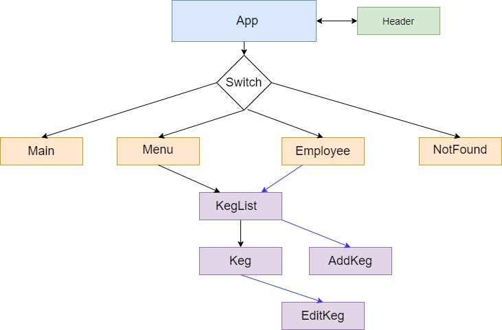

# Tap Room

#### _React: Tap Room, Last Update 02/14/2020_

## Description
A tap room in React where a bar or kombucha store can track their kegs. 

## Component Structure



## Installation:
1. Clone this repo:
```
$ git clone this-repo-url
```

2. Install npm:

```
$ npm install
```

3. Run the project:
```
$ npm run start 
```

4. Open up using browser of your choice: http://localhost:8080

## Specs

* As a patron, I am able to see a list/menu of all available kegs. For each keg, I can to see its name, brand, price, ibu and alcoholContent.
* As an employee, I am able to fill out a form when I tap a new keg to add it to the list. 
* As an employee, I am able to edit a keg's properties after entering them just in case I make a mistake.
* As an employee, I am able to see how many pints are left in a keg. (A full keg has roughly 124 pints).
* As an employee, I am able to click a button next to a keg whenever I sell a pint of it. This will decrease the number of pints left by 1.
* As an employee, I am able to see kegs with less than 10 pints left so I can be ready to change them. These kegs are highlighted by red.
* As a patron, I want to have kegs prices to be color-coded for easy readability. Perhaps based on their price (greater or less than $5 per pint, perhaps) or the particular style of beer or kombucha.
* As a patron, I can see different color of strength depending in the alcohol content property.

## Known Bugs
- No known bugs at this time

## Support and contact details
Nina Potrebich: potrebich@gmail.com

## Technologies Used
Git, GitHub, ReactJS and Webpack

## License
Copyright © 2020 under the MIT License